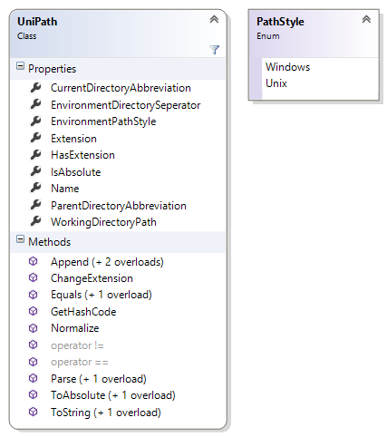

# PathPiper [](https://travis-ci.org/4lab/PathPiper) [](https://ci.appveyor.com/project/nikeee/pathpiper)
Making the world a better place by providing path abstraction.

```C#
// If pathstyle is omitted, the current system path style will be used
var path = UniPath.Parse("C:\Windows\System32", PathStyle.Windows);
Console.WriteLine(path.ToString());
Console.WriteLine(path.Name); // System32
Console.WriteLine(path.Extension); // ""
Console.WriteLine(path.HasExtension); // False
```


